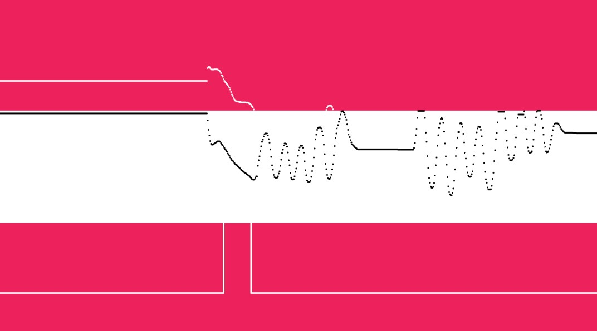

# Qiyue-Wang_qwan0249_Creative-coding-major-project
# Personal Code

## Interactions & Changes

My code is mainly through keyboard and mouse to interact, control some keys input some dynamic.

This code is changed from the static code of our group, where we consisted of a white dot in the background and a circle with overlapping loops, which gave us a static pattern element. In my code, I kept the white dots, but increased the divergence of the dots, and added changes to the zoom and position control of the circles, as well as a controllable brush.

## Inspiration
First of all, in terms of The setting of basic circles, I initially wanted to create them by teaching Apollonian Gasket in The Coding Train. I originally wanted to create countless tangential circles to create a filling effect, but our theme is a ring state. So we go back to our roots using nesting dolls. Inspired by Wassily Kandinsky's hand-painted works.

These artistic inspirations have influenced my choice of colors. The collision of colors and the flashing color interval in the middle circle are all selected to bring color impact as much as possible. At the same time, the colored lines can also be filled by the user to fill some real space.

[WassilyKandinsky](https://www.wassilykandinsky.net/work-370.php)

 [Class](https://www.youtube.com/watch?v=6UlGLB_jiCs)

## Functions code using
- Keyboard Function

[Keyboard control](https://processing.org/examples/keyboardfunctions.html)

First of all some basic use, my most basic part about the keyboard is the beginning of the reference to the week 7 control panel content, such as pressing the button position control and part of the image appear and zoom. Most of my derivation started from the classroom part, but in addition, I also found some examples about controlling the keys to do the step-by-step emergence test.

- Multiple Particle Systems
  
[Multiple Particle Systems](https://p5js.org/examples/simulate-multiple-particle-systems.html)

From Daniel Shiffman's code tech reference, this section is sort of an added element from the example, using active particle patterns, such that the particle images are dispersed in clusters with a tendency to taper off, and are a particle selector group appearing via keystrokes. Right-clicking will bring up the group of dispersing particles on the screen, and this element can also echo the polka dots in our background.

- Conditional Shapes
  
[Conditional Shapes](https://p5js.org/examples/control-conditional-shapes.html)

Inspirationcontributed by Prof WM Harris, it's about following a mouse through a fixed shape to make a stroke. He used squares, and circles to create the trajectory. I added a brush function to allow the user to draw lines on their own. And the colored lines would be more in line with my theme.

 

## More Examples 
- Mouse Signals 

[Mouse Signals](https://p5js.org/examples/input-mouse-signals.html)

- Pacita Abad

[Pacita Abad](https://www.sfmoma.org/read/pacita-abad-a-living-tapestry-of-places/)

## Technical Explanation

- 'whiteDots' is an array that stores the locations of white dots scattered in the background.
- These points are randomly drawn when the canvas is created.

- A 'ColoredCircle' class creates circles with several layers of color, each circle changing color over time. You can move these circles using the arrow keys and resize them using the 'A' and 'B' keys. When you press the space bar, the center circle returns to its original position and color.

- Hold down the left mouse button and drag to draw lines.

Particles are small dots that gradually disappear over time. I manage a bunch of particles using the "particles system" class. The user can create a particle system in the mouse position by right-clicking.

Technology use
To start the sketch, 'setup()' creates a 600x600 pixel canvas and sets the background color. Scatter 200 random white dots across the canvas. I'm creating seven colored circles at specific locations. Each circle has three layers of color.

'draw()' repeats, updating the canvas every second and redrawing the background and white dots. Set updates and draw each colored circle, making sure the inner circle changes color smoothly. Set updates and draws each particle system, adding new particles and deleting old ones.

User interaction using the keyboard: Arrow keys move all circles. The A "key increases the size of all circles. The 'B' key reduces the size of all circles. The space bar resets the circle to its original state.

User interaction Using mouse: Left click and drag to draw lines. Right-click at the cursor position to create a new particle system.

Add components to the above elements, creating classes separately.
